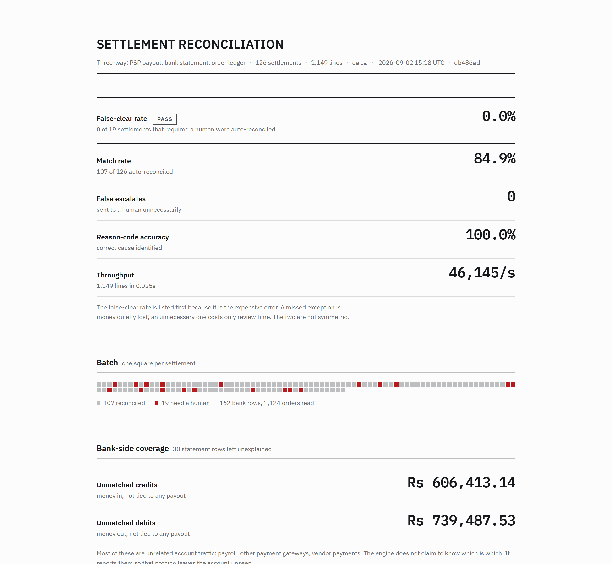
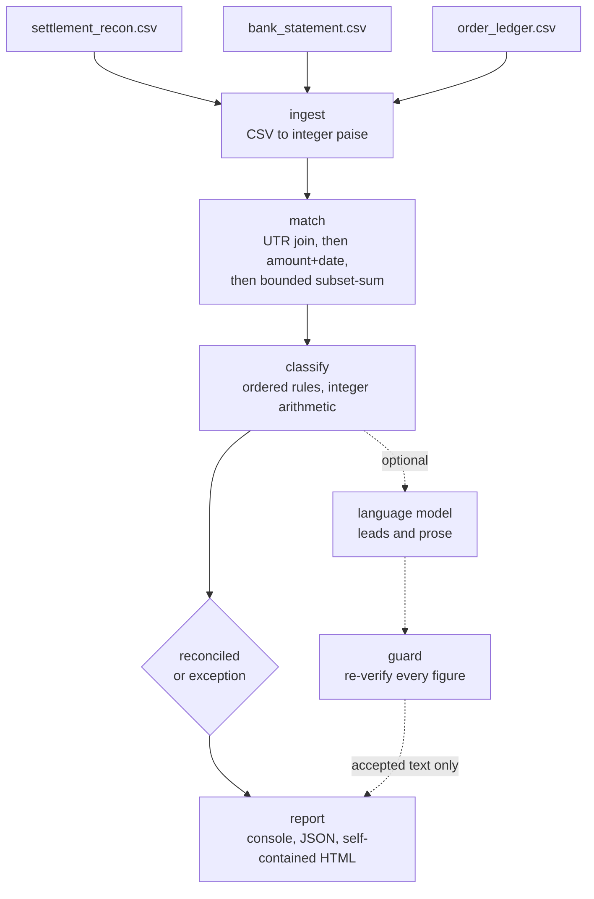

# Three-way settlement reconciliation

[](https://github.com/VanshS-21/Razorpay-Submission/actions/workflows/ci.yml)
[](https://www.python.org/downloads/)
[](LICENSE)

**Razorpay AI Buildathon — Track 04, AI Finance Controller**
By [Vansh S](https://github.com/VanshS-21)

<!-- Demo video: paste the link on the line below once recorded. -->

---

## The problem

A bank does not credit a merchant per payment. It credits **one net lump sum per
transfer**, covering many payments minus fees, GST, refunds, chargebacks and
adjustments, and it may sweep several payouts into a single NEFT while quoting
only one UTR. So "which settlement is this credit for?" has no answer. The
answerable question is "which **subset** of settlements does this credit cover?",
and that is a search rather than a lookup. This is why reconciliation is still
done by hand at most merchants.

Three sources should agree and never quite do:

| source | what it says |
|---|---|
| `settlement_recon.csv` | what Razorpay says it paid out, line by line |
| `bank_statement.csv` | what actually landed in the account |
| `order_ledger.csv` | what the business thinks it sold |

## What this does

Reconciles all three across a batch, reports a match rate, and produces an
exception list for everything it could not explain. Each exception names the
money, the evidence, and a next action.

```bash
python demo.py
```

The demo needs Python 3.11+ and the standard library. Nothing else, no API key,
no network. `pip install -e ".[dev]"` adds pytest for the test suite.



`out/report.html` is one self-contained file with fonts embedded, so it opens
offline from a fresh clone and prints clean.

---

## The numbers

| | main set | adversarial holdout |
|---|---|---|
| Settlements | 126 | 24 |
| **False-clear rate** | **0.0%** (0/19) | **0.0%** (0/12) |
| False-escalate rate | 0.0% (0/107) | 0.0% (0/12) |
| Match rate | 84.9% | 50.0% (compound defects, outside the classifier's design by construction) |
| Reason-code accuracy | 100.0% | 100.0%, of which 83.3% exact primary |
| Unexplained bank rows | 30, all reported | 0 |
| Throughput | 1,149 lines; 24k-51k lines/sec across nine runs, see [`eval/metrics.md`](eval/metrics.md) | |

194 tests. No API key or network required for any of them.

**Read the false-clear rate first.** It counts settlements the engine called
reconciled that the answer key says needed a human. That is the expensive error:
a missed exception is money quietly lost, while an unnecessary one costs review
time. The two rates have different denominators on purpose — false clears over
the units that must escalate, false escalates over the units that should
reconcile. Each is the population its error can occur in.

**84.9% matched and 0.0% falsely escalated are consistent.** The other 15.1% is
19 settlements that genuinely need a human — a real shortfall, a duplicate bank
credit, a refund the books do not corroborate — plus 30 bank rows the engine
could not tie to any payout and reports rather than guesses at. A false escalate
would be a settlement sent to a human that the answer key says was fine. There
are none. The engine is not escalating out of caution; it is escalating things
that are actually wrong.

**The 100% on the main set is a regression guard, not a result.** I wrote the
defect generator and I wrote the detection rules, so that number measures whether
two expressions of the same assumptions agree. The holdout is the number worth
reading. See [Honest measurement](#honest-measurement).

Throughput is quoted as a range because nine identical runs here spanned
24k–51k lines/sec. At 1,149 lines it is not a scalability claim either: the
dataset fits in cache, and the subset-sum pass is quadratic in settlement count.

Full per-class results and caveats: [`eval/metrics.md`](eval/metrics.md).

---

## Architecture

> Deterministic where money is concerned. Probabilistic only where language is.



| layer | implementation | why |
|---|---|---|
| Exact UTR join | integer arithmetic | most of the volume, no ambiguity |
| Amount + date fallback | integer arithmetic | for unusable reference fields |
| Subset-sum decomposition | exhaustive, bounded, exact | consolidated transfers |
| Ledger + refund verification | integer arithmetic | makes the third source load-bearing |
| Fee / GST / dispute identities | integer paise | the ledger identity must hold |
| Bank narration to identity | language model | genuinely fuzzy text |
| Exception note for a human | language model | genuinely generative |
| Guard | deterministic re-verification | nothing from a model is trusted |

**Money is integer paise everywhere. No floats anywhere in the money path.**
`0.1 + 0.2 != 0.3`, and an engine that cannot decide equality cannot reconcile.

### Where I deliberately did not use a model

The obvious build is to hand the whole ledger to a model and ask it to
reconcile. Such a system cannot report an honest match rate, because it cannot
tell you why it was right. Every figure this engine produces traces to an
arithmetic identity a human can re-derive.

The model may not compute, round or estimate any amount; decide whether a
settlement is reconciled or escalated; or assign a reason code. It may *propose*
a match, which is then re-checked against the same exact-amount and date-window
test the deterministic matcher uses, and a proposal that passes is attached as an
advisory lead rather than applied.

[`src/recon/agent/guard.py`](src/recon/agent/guard.py) enforces this. Generated
prose is scanned for every rupee figure it contains — `Rs`, `Rs.`, `INR`, `₹`,
the HTML entity, and amounts with the unit trailing — and the whole output is
rejected if one figure was not computed by the engine for that settlement. A
plausible wrong number in a finance note is worse than no note, because someone
will quote it to their bank. Rejections are counted and published as a guard
rejection rate.

**What the guard does not do.** It verifies that every figure is real, not that
the sentence around it is true. The allowed set for one settlement is every value
the engine derived for it, a median of 35, so a note that cites a real figure in
the wrong role, or gets a direction backwards, passes. Catching that needs
semantic verification, which this project does not claim to do.

### What the model turned out to be worth

Less than I expected. I built the `MISSING_UTR` class — bank rows whose reference
field is unusable — expecting it to be the case that justified a
narration-resolving model. Before writing the engine I recorded a prediction:
*deterministic matching will resolve ≥90% of these on its own.* It resolves
**100%** (9/9), by exact amount-and-date fallback.

I did not respond by making the data harder so the model would look necessary.
The narration resolver stays in, gated behind arithmetic, invoked only on genuine
residue. On the shipped data that residue is empty, so the resolver makes **zero
calls**. The model's real value is the other subsystem: writing the exception
notes a human has to act on, which is 19 calls on this batch.

---

## Honest measurement

### The main set cannot produce a real accuracy number

Twelve defect classes, one per settlement, stratified so every class has ≥5
instances. The engine scores 100%. I tried twice to break that number and
failed: once by overlapping the magnitude bands so no size threshold could
separate a true mismatch from a bank charge, and once by adding a class only
three-way reconciliation can catch. Both were caught, because I wrote each check
at the same time as the defect it detects.

The second failure was the useful one. The problem is structural: any defect I
invent is one I already know how to detect.

### So: a holdout of compound defects

[`src/recon/adversarial.py`](src/recon/adversarial.py) builds settlements
carrying **two defects at once**. The classifier is single-label with an ordered
rule chain, so compounds sit outside its design by construction.

It failed immediately, and correctly:

```
False-clear rate      33.3%   (4 of 12)   [FAIL]
False-escalate rate   33.3%
```

Both causes were real bugs:

1. **Phantom refunds were cleared.** The three-way check compared only *payment*
   lines against the order ledger. A refund reduces the payout and the bank
   credit identically, so it always ties, and a refund for an order the books
   never refunded was invisible to every totals-based check. I had written a
   three-way reconciler that only did three-way on the direction where money
   comes in.
2. **Consolidated payouts with a transfer charge were escalated as never paid.**
   Subset-sum requires exact totals, and a Rs 23 charge broke exactness.

Both fixed, both pinned with regression tests. Post-fix: 0 false clears, holding
across four independent seeds.

### The caveat that undercuts my own headline

Once I fixed the engine against that holdout, it stopped being unseen data. It is
training data now, and 0% on it is not an independent measurement. What I can
claim is that the fixes generalise across seeds within the same compound
families. A genuinely independent number needs defect families written by someone
who has not read `classify.py`.

The project has since been through three structured review passes. All three were
AI-assisted: an agent was given the repository, no prior context, and a written
brief, and I verified each finding myself before acting on it. They are not
independent audits by a person, and the number of defects they found is the
reason this section exists rather than evidence that the engine is sound. What
each one found, and what changed, is in
[`docs/FAILURE_LOG.md`](docs/FAILURE_LOG.md).

---

## The exception list

```
setl_4TC0N0K4440284  ledger_mismatch                   Rs 0.00
    1 refund(s) totalling Rs 5,847.41 were debited from this payout for
    order(s) the ledger still records as not refunded (order_JECZYYKK6G0212).
    The settlement ties to the bank exactly, because the refund reduces both
    sides equally -- the books are the only source that disagrees.
    ACTION: Verify each refund against the order record before closing. An
    uncorroborated refund is either a misposting or money leaving on an
    instruction nobody authorised.
```

The delta is `Rs 0.00`. Every total balances. This is the case a
bank-versus-payout reconciliation cannot see, and it is why the third source
carries weight.

---

## Running it

```bash
python demo.py                      # everything, one command
open out/report.html                # visual report, self-contained and offline

pip install -e ".[dev]"             # adds pytest
python -m pytest tests/ -q          # 194 tests
python eval/run_eval.py             # regenerate eval/metrics.md
python eval/check_claims.py         # verify this README against a live run
```

Individual stages need the package installed, because they run as modules:

```bash
pip install -e .
python -m recon.generate --out data --seed 42 --settlements 120
python -m recon.cli --input data --out out
```

Exit codes: `0` clean, `1` a false clear, `2` an unreadable source file, `3` the
model layer was requested and produced nothing, `4` scoring was incomplete.

### The model layer, if you want it

Off by default. Two vendors sit behind one adapter; everything above it is
written against a single method, and which company answers lives in
[`src/recon/agent/llm.py`](src/recon/agent/llm.py) and nowhere else.

```bash
export GEMINI_API_KEY=...           # or ANTHROPIC_API_KEY
python -m recon.cli --input data --llm --provider auto
```

Run it against two backends and compare the verdicts:

```bash
jq '.findings[]|{settlement_id,disposition,reason_code,delta}' out/run.json
```

**No disposition, reason code or delta moves.** That is structurally guaranteed:
`_attach_proposals` writes only `action_required`, `narrate_exceptions` writes
only `explanation`, `action_required` and `resolved_by`, and no path re-enters
the classifier.

It has now been run against **two live models** on the same 126-settlement
dataset — `gemini-3.5-flash` and `gemini-3.7-flash`
([`out/agent.json`](out/agent.json),
[`out/agent-second-model.json`](out/agent-second-model.json)):

```
settlements where disposition / reason_code / delta differ:    0 of 126
settlements where the explanation text differs:               19
false clears, match rate, reason-code accuracy:         identical
```

The second run is the more useful half, because it **failed**: 1 note out of 19,
eleven errors, eight rate limits, and seven calls the circuit breaker never
sent. One model wrote every note, the other wrote almost none, and the
reconciliation came out byte-identical. A model layer that can fail that badly
without moving a verdict is the claim, demonstrated rather than asserted.

Still one vendor — Anthropic has never had a key here, so the Anthropic backend
remains exercised only by the scripted stub.

`--llm-stub` drives the same code path with a scripted client that misbehaves on
purpose: `honest`, `hallucinating`, `overreaching`, `failing`, `refusing`,
`truncated`, `plausible`.

**The invariant: whatever the model does — lies, overreaches, dies, refuses,
gets truncated, or answers entirely plausibly — the set of settlements escalated
to a human does not shrink, and no verdict moves.**

`hallucinating` is the one to run if you want to watch the guard work.
`overreaching` and `plausible` act on the resolver, which the shipped data never
invokes, so on this dataset they produce output identical to `honest`. Both are
exercised by tests that build their own ambiguous fixtures.

### What a real run measured

Measured against Gemini. No Anthropic key was available, so that backend has
never met a live API and is exercised only by the scripted stub.

The full batch has now been run end to end against `gemini-3.5-flash`: all 126
settlements, 19 exceptions, 19 calls, nothing capped. Committed at
[`out/agent.json`](out/agent.json) so the arithmetic is checkable.

```
8,288 input · 3,376 output · 22,423 thinking tokens · $0.2446 · 264s
19 of 19 notes accepted · 0 guard rejections · 0 errors · 0 rate limits
```

- **$0.1941 per 100 records, measured.** This section used to say a full
  batch's cost was unknown, because every run had been capped and
  `per_n_records` refuses to scale one. It is not unknown any more. An earlier
  draft published `$0.1895` here as "the real figure"; that was
  `$0.0199 x 19/2`, an extrapolation wearing a measurement's clothes. It turned
  out to be **2.4% from the measured value** — which changes nothing about
  whether it should have been published. A guess that lands close is still a
  guess, and the reader had no way to tell which they were reading.
- **Thinking tokens are 87% of the output and 83% of the bill, and appear
  nowhere in the reply.** Gemini reasons before answering; that reasoning is
  billed at the output rate and is absent from `total_output_tokens`. Counting
  only output tokens understates this batch by **5.7×**. The figure has now held
  across four independent runs of 1, 2, 3 and 19 calls: 88.9%, 87.3%, 85.3%,
  86.9%.
- **The guard rejected nothing, and that is the result of a fix.** 0 of 19.
  Six of those notes are `LEDGER_MISMATCH`, the class whose notes the guard was
  rejecting that same morning because the order ledger's values were missing
  from its allowed set (below). Before that fix roughly a third of this batch
  would have been thrown away and the rejection rate would have read as
  diligence.
- **Pacing held, and was still not right.** 13.9 seconds per call, 4.3
  requests a minute, not one 429 across 19 calls. The provider's dashboard
  nonetheless reported a peak of **6 a minute against a limit of 5**, because a
  fixed sleep between calls bounds the gap between consecutive requests and not
  a sliding window — and the limiter began each process with no memory of the
  run before it, while three runs went out minutes apart. It is a real window
  now, capped one below the limit, because a limiter with no margin is wrong the
  moment anything jitters.
- **A smaller complete batch, for comparison.** 25 settlements, 3 exceptions,
  `$0.1442 per 100 records`
  ([`out/agent-small-batch.json`](out/agent-small-batch.json)). Lower because
  that batch has a 12% exception rate against the main set's 15%, which is the
  reason a per-100-records figure from one dataset does not transfer to another.
- **The default model is the one with a consistent record, and the reason is
  not the one I first gave.** `gemini-3.7-flash` is newer and half the price.
  Roughly eighteen requests to it timed out at a 90-second ceiling, starting
  from a fresh daily quota, so the cause was not the daily cap. I wrote that up
  as the model being slow or not answering. Then it answered in **25.5 seconds**
  — comfortably inside the ceiling it had been blowing through — with 462 input,
  205 output and 780 thinking tokens for $0.00404, about 3.4x cheaper per note
  than 3.5 Flash and using 40% fewer thinking tokens.

  So "3.7 Flash is slow" is ruled out, and why those eighteen requests were
  never answered is **unknown**. Several things differed between the two
  attempts — the key, the elapsed time, and the request pacing, which was 3.5s
  (17 requests a minute against a limit of 5) during the failures and 12.5s
  during the success. That last one is a plausible contributing factor and is
  untested; exceeding a per-minute limit ought to produce a 429 rather than
  silence, so it is a hypothesis rather than an explanation.

  The default stays `gemini-3.5-flash` on track record: 25 calls across four
  runs, no failures. 3.7 has one success and eighteen unexplained timeouts. It
  is cheaper and it is available through `--model`, and on this evidence it is
  worth retrying, but the default should be the one that has never yet failed
  rather than the one that is cheaper when it works.

The same batch reconciles in 0.04 seconds with zero model calls and identical
verdicts.

#### What running it actually taught

Earlier the same day, a 3-call batch rejected 1 of 3 notes with
`invented_figure:2748.78`. That looked like the guard catching a live model. It
was a **false positive**, and it is the most useful thing any model call has
produced here.

`narrate._facts` puts the engine's own finding in the prompt: *"largest is
order_U40W9CGY3T0514 booked at Rs 2,154.63 against a ledger value of
Rs 2,748.78."* The model quoted that ledger value back, correctly, in a
`LEDGER_MISMATCH` note — the class of finding that is *entirely about* comparing
a settlement line to the order ledger. `allowed_figures_for` built its set from
settlement lines and bank rows and never included order-ledger values, so the
system handed the model a number and then rejected it for repeating it.

No stub could have found this. The scripted client cites figures from the facts
block or an impossible constant; it never quotes a real third-source value. The
guard now allows every figure the engine states in its own explanation, which is
the general rule that covers this and the earlier version of the same bug, where
`Rs 0.00` was excluded and the guard rejected the truest sentence in the report.

Both directions are pinned by tests: the engine's own explanation must pass, and
a figure from nowhere must still be rejected. The full batch run afterwards
rejected 0 of 19, six of which were `LEDGER_MISMATCH` notes — the ones that
would have been thrown away before the fix.

Cost is reported only for a model whose price has been read, and only when the
whole batch ran. An unpriced model prints no figure, because `$0.0000` reads as
"free" rather than "unknown".

---

## Known limitations

- **A zero false-clear rate is scored against the answer key, not against
  reality.** The key comes from the same generator as the data, so it can only
  mark a settlement wrong in a way the generator knows how to produce. A defect
  outside that vocabulary makes the engine wrong while the rate still reads 0.0%.
  The number answers a narrower question than "nothing was missed".
- **A consolidated transfer is cleared on arithmetic alone.** Nothing in the
  statement names the other payouts in the group. "These payouts sum to this
  credit" and "this credit paid these payouts" are different statements, and an
  over-credit sitting beside an unrelated unpaid payout of the right size
  satisfies the first only. It is indistinguishable from a real consolidation in
  the data, so no rule fixes it. Every such clear is marked
  `deterministic:inferred` at 0.90 confidence and listed under **SPOT CHECK**.
- **The guard checks figures, not claims.** A real number used in the wrong role
  survives it.
- **Sub-rupee blindness.** Differences ≤5 paise are absorbed as fee/GST rounding,
  so this cannot detect sub-rupee skimming. Deliberate, and a real hole.
- **Synthetic data throughout.** No real settlement report was used, and real
  ones are messier in ways this generator does not imagine. Anomaly rates are
  also inflated far above the 1–2% a real merchant sees, so the rare classes have
  enough support to be scored.

Seven more — single-label classification, charge attribution, contested
consolidations, single currency, per-file money units, float cost accounting, and
narration-keyword charge detection — are in
[`docs/LIMITATIONS.md`](docs/LIMITATIONS.md).

The schema mirrors Razorpay's
[settlement recon report](https://razorpay.com/docs/api/settlements/fetch-recon/)
fields (`entity_id`, `type`, `debit`, `credit`, `fee`, `tax`, `settlement_utr`, …).

---

## Layout

```
src/recon/
  models.py            entities; integer-paise money; the defect taxonomy
  generate.py          synthetic three-source data + ground-truth answer key
  adversarial.py       compound-defect holdout
  ingest.py            CSV to typed records, converted to paise at the boundary
  engine/
    arithmetic.py      tolerances, each with its justification and failure mode
    matcher.py         UTR join, then amount+date, then bounded exact subset-sum
    classify.py        ordered rules; the default verdict is "I don't know"
    pipeline.py        the run, with the optional agent pass
  agent/
    guard.py           re-verification of everything a model returns
    fake.py            scripted misbehaving client, for testing the guard
    resolve.py         narration to settlement identity (proposal only)
    narrate.py         exception notes for humans
    llm.py             vendor boundary, model config, token and cost accounting
  report.py            scoring; false-clear rate first
  report_html.py       self-contained HTML report
eval/run_eval.py       regenerates eval/metrics.md
eval/check_claims.py   fails if this README disagrees with a live run
docs/FAILURE_LOG.md    what broke, kept live rather than reconstructed
docs/GLOSSARY.md       the domain terms, in plain language
```

## Documents

- [`eval/metrics.md`](eval/metrics.md) — full results, per class, with caveats
- [`docs/FAILURE_LOG.md`](docs/FAILURE_LOG.md) — what broke, in order, including
  three AI-assisted review passes and what each one found
- [`docs/GLOSSARY.md`](docs/GLOSSARY.md) — UTR, settlement, paise, subset-sum
- [`docs/LIMITATIONS.md`](docs/LIMITATIONS.md) — the full list
